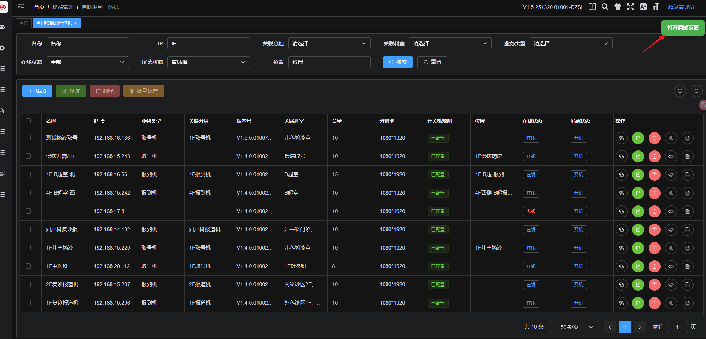

2025/12/6
---

# 🛠️ 安装 门诊web调试页面加载 Chrome 扩展``

本扩展用于在公司内部 7000 端口项目中快速打开调试页面，并支持自动跳转本地开发环境。``

> ✅ 仅需 **解压 ZIP + 1 次点击** 即可安装，无需开发者账号。

---

## 🔧 安装步骤

1. **解压 ZIP 文件**  
   将你收到的 `tple-debug-extension.zip` 解压到任意文件夹（例如：`D:\chrome-extensions\tple-debug-extension`）。

2. **打开 Chrome 扩展管理页**  
   在 Chrome 浏览器地址栏输入：
   ```
   chrome://extensions
   ```

3. **启用开发者模式**  
   在页面右上角，打开 **「开发者模式」** 开关。

   

4. **加载已解压的扩展程序**  
   点击左上角 **「加载已解压的扩展程序」** 按钮，  
   选择你刚才解压的文件夹（必须包含 `manifest.json` 文件）。

5. **安装完成！**  
   扩展将出现在列表中，图标为绿色按钮。  
   访问 `http://xxx:7000/...` 页面时，右上角会自动显示 **「打开调试页面」** 按钮。




---

## ❓ 常见问题

- **Q：为什么安装后没有按钮？**  
  A：请确保当前页面 URL 的端口是 `7000`，且路径不包含 `/#/sbIndex`。

- **Q：访问 iframeIndex2.html 页面没跳转？**  
  A：请确认本地开发服务 `http://localhost:8080` 已启动。

- **Q：能直接拖 `.zip` 安装吗？**  
  A：不能。Chrome 要求先解压，再通过「加载已解压的扩展程序」安装。

---

> 💡 提示：如需卸载，进入 `chrome://extensions`，点击扩展右下角的「删除」即可。

--- 

✅ 现在，尽情使用吧！
