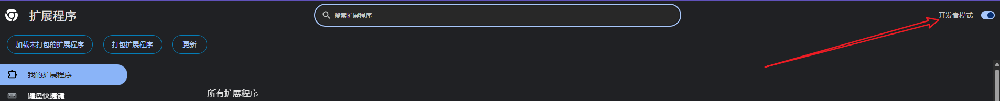
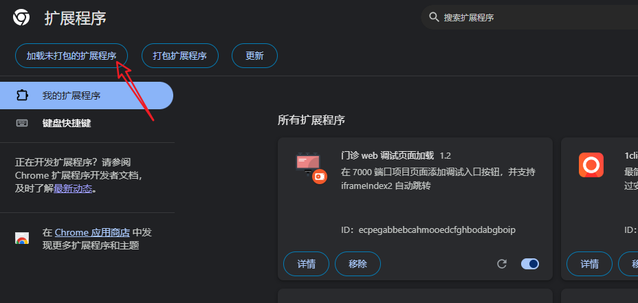
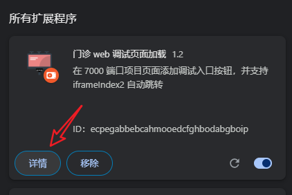
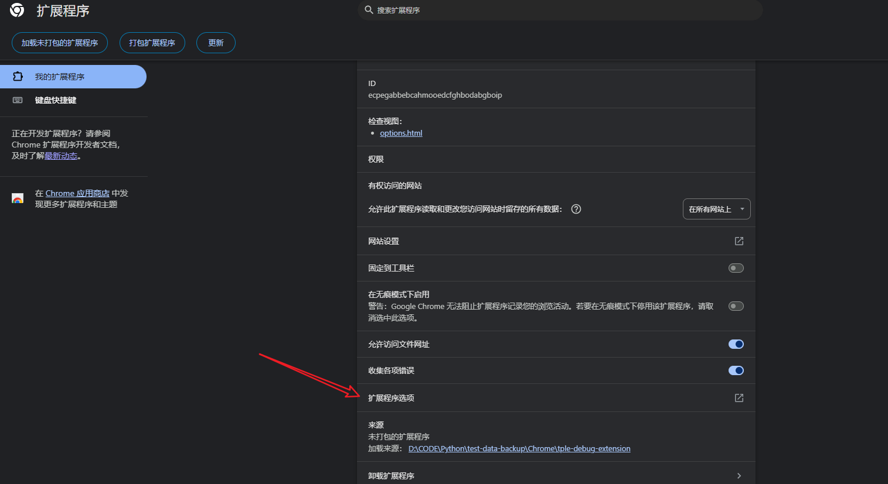
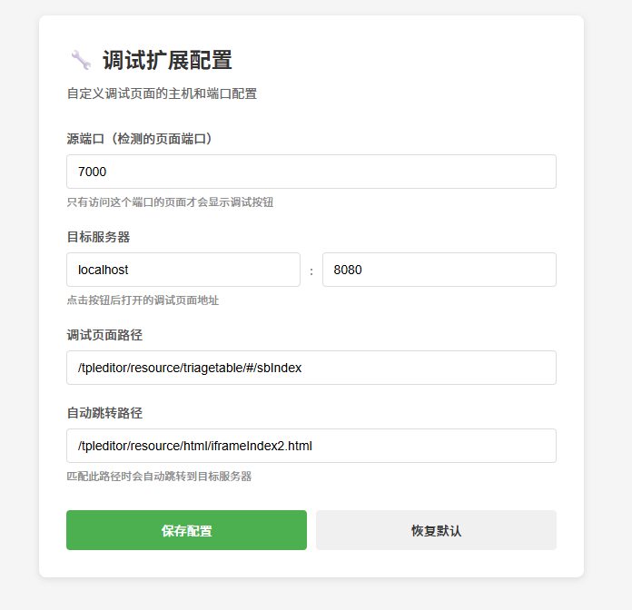

2025/12/6
---

# 🛠️ 安装 门诊web调试页面加载 Chrome 扩展

本扩展用于在公司内部 7000 端口项目中快速打开调试页面，并支持自动跳转本地开发环境。

> ✅ 仅需 **解压 ZIP + 1 次点击** 即可安装，无需开发者账号。

---

## 🔧 安装步骤

1. **解压 ZIP 文件**  
   将你收到的 `tple-debug-extension.zip` 解压到任意文件夹（例如：`D:\chrome-extensions\tple-debug-extension`）。

2. **打开 Chrome 扩展管理页**  
   在 Chrome 浏览器地址栏输入：
   ```
   chrome://extensions
   ```

3. **启用开发者模式**  
   在页面右上角，打开 **「开发者模式」** 开关。

   

4. **加载已解压的扩展程序**  
   点击左上角 **「加载已解压的扩展程序」** 按钮，  
   选择你刚才解压的文件夹（必须包含 `manifest.json` 文件）。

    

5. **安装完成！**  
   扩展将出现在列表中。  
   访问 `http://xxx:7000/...` 页面时，右下角会自动显示 **调试工具按钮**。

6. **可以拖拽移动按钮位置**


7. **配置扩展**
   1. 点击插件详情
   2. 点击扩展程序选项
   3. 配置源端口、目标服务器、调试页面等





---

## 📋 功能说明

点击调试按钮展开菜单，包含以下功能：

| 功能 | 说明 |
|------|------|
| 🔍 打开调试页面 | 在新标签页打开调试页面 |
|  复制 localStorage | 生成可执行脚本并复制到剪贴板 |
|  模拟批量挂号 | 手动输入 Headers 和 JSON Body，批量调用挂号接口 |
| 🔎 打印 Storage 内容 | 在控制台打印所有 storage 数据 |

---

## ⚙️ 配置项说明

| 配置项 | 说明 | 默认值 |
|--------|------|--------|
| 源端口 | 检测的页面端口，只有访问该端口的页面才显示按钮 | 7000 |
| 目标服务器 | 点击按钮后打开的调试页面地址 | localhost:8080 |
| 调试页面路径 | 调试页面的 URL 路径 | `/tpleditor/resource/triagetable/#/sbIndex` |
| 自动跳转路径 | 匹配此路径时自动跳转到目标服务器 | `/tpleditor/resource/html/iframeIndex2.html` |
| 收缩态图片 | 按钮未展开时显示的图片 URL（支持远程链接，留空使用默认绿色按钮） | 空 |
| 展开态图片 | 按钮展开时显示的图片 URL（支持远程链接，留空使用默认红色按钮） | 空 |
| 菜单自动收起时间 | 展开菜单后多少秒自动收起，填 0 表示不自动收起 | 10 秒 |

---

## 🎨 自定义按钮图片

支持使用远程图片 URL 替换默认按钮：

1. 打开扩展配置页
2. 在「收缩态图片」和「展开态图片」中填写图片 URL
3. 支持格式：`https://raw.githubusercontent.com/.../xxx.png`
4. 留空则使用默认纯色按钮
5. 图片加载失败会自动回退到默认按钮

---

## ❓ 常见问题

- **Q：为什么安装后没有按钮？**  
  A：请确保当前页面 URL 的端口是配置的源端口（默认 7000），且路径不包含 `/#/sbIndex`。

- **Q：访问 iframeIndex2.html 页面没跳转？**  
  A：请确认本地开发服务 `http://localhost:8080` 已启动。

- **Q：能直接拖 `.zip` 安装吗？**  
  A：不能。Chrome 要求先解压，再通过「加载已解压的扩展程序」安装。

- **Q：自定义图片不显示？**  
  A：请检查图片 URL 是否正确，图片加载失败会自动回退到默认按钮。

- **Q：菜单自动收起了，怎么关闭？**  
  A：在配置页将「菜单自动收起时间」设为 0 即可禁用自动收起。

---

>  提示：如需卸载，进入 `chrome://extensions`，点击扩展右下角的「删除」即可。

--- 

✅ 现在，尽情使用吧！
